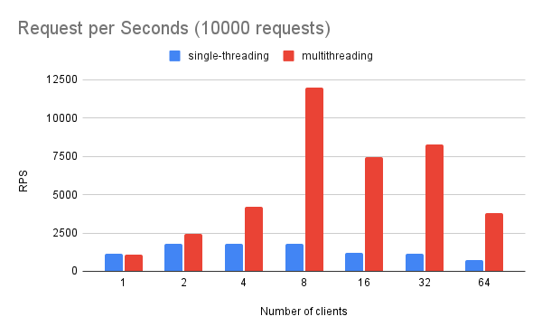

# Description

C server using MySQL and HTTP.

# Setup

```sh
cd cs1
./cmd.sh init # Initialize Docker container.
./cmd.sh make # Build source codes in the container.
./cmd.sh run # Run the program.
```

# Benchmarking

`cmd.sh bench` benchmarks this server with `ab`, [Appache HTTP server benchmarking tool](https://httpd.apache.org/docs/2.4/programs/ab.html).

```sh
./cmd.sh make # Single-threading.
./cmd.sh run &
./cmd.sh bench 4 5000 # 4 clients, 5000 request.
```

```sh
./cmd.sh make multi # Multithreading.
./cmd.sh run &
./cmd.sh bench 8 10000 # 8 clients, 10000 request.
```

## Result

- Condition
  - Request per seconds(10000 requests)
  - on 8 core 16 thread machine
  - Each RPS is the avearge of 3 trials



The single-threaded version peaks at 2 clients. When the number of clients is 1, the bottleneck may be on the client side, not the server side.  
The peak of the multithreaded version is 8 clients. Considering the machine has 8 cores, this looks reasonable. According to this result, the performance of this server depends on the number of phisical cores, instead of the number of logical threads.

# Behavior

The main thread is waiting for requests on `epoll`. The main thread either `accept`s the incomming request if it is a `connect` request, or reads the data and passes it to a new worker thread.  
A new thread and a new MySQL connection are created for each request.
